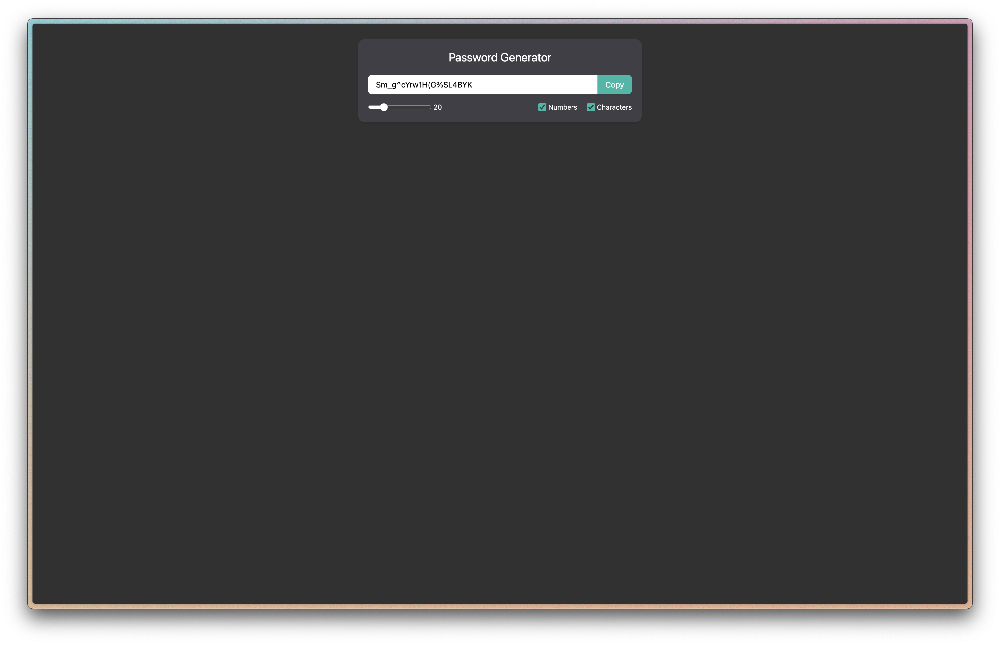

# Password Generator 🔒

A responsive and customizable **Password Generator** built with React and styled using Tailwind CSS. This project generates secure passwords with adjustable length and options to include numbers and special characters. It also features an easy-to-use "Copy to Clipboard" button.

---

## Features

- **Password Length Selection**: Adjustable password length from 8 to 64 characters.
- **Include Numbers**: Option to include numeric digits (`0-9`) in the password.
- **Include Special Characters**: Option to include symbols like `!@#$%^&*()[]{}=_-`.
- **Copy to Clipboard**: One-click functionality to copy the generated password.
- **Real-Time Password Update**: Password changes dynamically based on selected options.

---

## Screenshot

---

## Tech Stack

- **React**: For building the UI and managing state.
- **Tailwind CSS**: For responsive and modern styling.
- **JavaScript ES6**: For logic and interactivity.

---